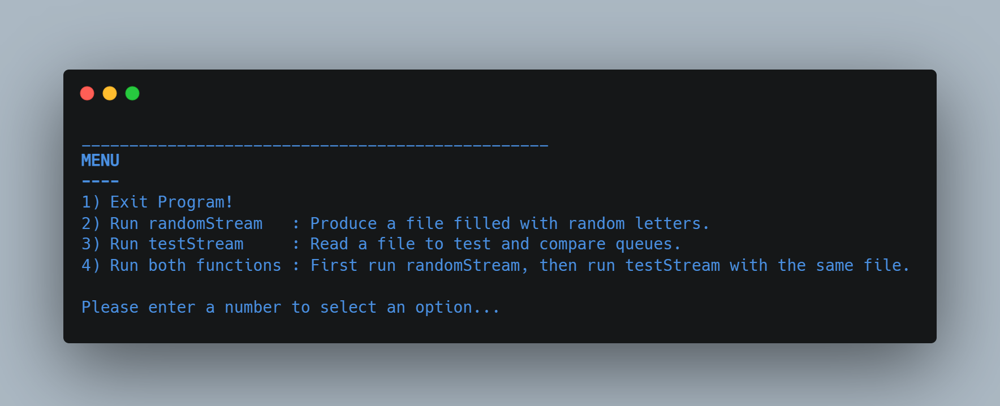

# Testing My Queue vs STL Queue

Data Structures

(FSC-BCS-370-HW3)

## Output Menu

## Assignment Context

This project was the third of a three part series of assignments for my C++ Data Structures class.

The goal of this assignment was to replace one of my queues from HW2 with the STL queue, then test the four queues against each other.

HW1: https://github.com/alexander-harmaty/Random-Stream-Generator
HW2: https://github.com/alexander-harmaty/Testing-Queue-Methods-with-RandomStream

This project was made using C++ in Visual Studio 2019.

## Features

This C++ code opens with a menu for users to choose between 4 actions:
1. Exit program
2. Run randomStream (HW1)
3. Run testStream (HW2)
4. Run randomStream then testStream (HW2)

The actions for "A", "D", "P", and "E"  have been modified to their closest analogue with std::queue.

## How It Works

### Option 2

The `randomStream()` function prompts the user to name the file that will be used to save the generated random characters and letters.
This part is taken from the HW1 repository referenced in the Assignment Context.
See https://github.com/alexander-harmaty/Random-Stream-Generator

### Option 3

This option is the first example of `testStream()`.

The function reads the instructions from the file whose name is passed to it as the filename parameter. 
The function then creates four instances of the farmingdale::queue ADT holding std::strings, calls the appropriate methods for each instruction in the file, and compares the results as described above.
If no failures and line errors return, then `testStream()` SUCCESS is to be expected.
See https://github.com/alexander-harmaty/Testing-Queue-Methods-with-RandomStream

### Option 4

This option is a combination of options 2 & 3.
It first runs `randomStream()`, then `testStream()` on the same file.

